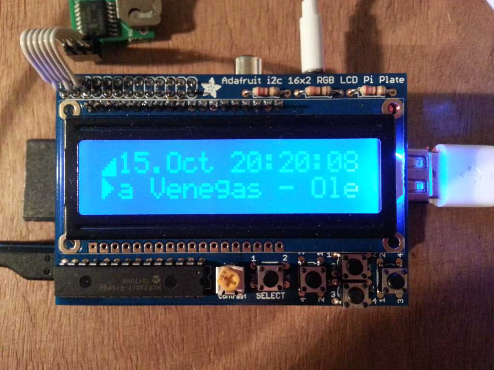

pimp3clock.py
=============

pimp3clock is a simple MP3 Player/Clock for the Raspberry PI with an
Adafrut i2c 16x2 RGB LCP Plate (http://www.adafruit.com/products/716)
attached.

It is written in python and needs only one additional library:

- mpd (https://pypi.python.org/pypi/python-mpd/)

On raspbian you can install it with <sudo apt-get install python-mpd>

Additionaly to play the mp3 files you have to install and load mpd:

<sudo apt-get install mpd>

Copy mp3 files to: </var/lib/mpd/music>

The pimp3clock.py has to be started as root so it can access the i2c bus.

